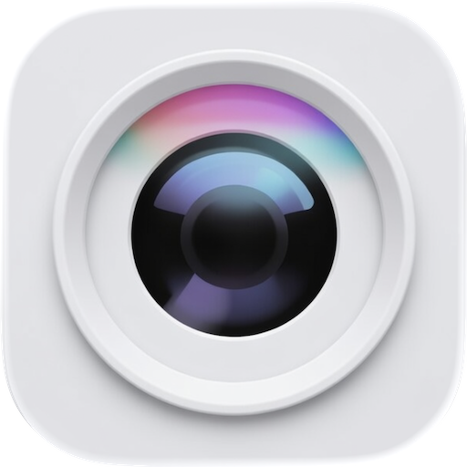

<div align="center">
    
    <h3 align="center" style="margin-top: 8px;">Floating Camera</h3>
</div>

# Floating Camera

A lightweight macOS utility that shows a camera view as a floating, always-on-top overlay.

- Floating, borderless, resizable camera view
- Lock position with click-through passthrough to apps below
- Hover opacity when locked — dims on hover, restores on exit
- Size and position controls, with multi-screen support
- Customizable global shortcuts
- Persists settings across launches

## Quick Start

```bash
swift FloatingCamera.swift
```

## Build and Install

Place all files in the same folder:

```
FloatingCamera.swift
build.sh
Info.plist
FloatingCamera.entitlements
AppIcon.icns
```

Then run:

```bash
chmod +x build.sh   # first time only

# Apple Silicon (default)
./build.sh

# Intel Mac
./build.sh --intel

# Universal binary (runs natively on both Apple Silicon and Intel)
./build.sh --universal

# Build and install directly to /Applications
./build.sh --install
./build.sh --universal --install
```

The compiled app lands in `./build/FloatingCamera.app`.

**Requirements**

- macOS 12 (Monterey) or later
- Xcode Command Line Tools (`xcode-select --install`)

## File Structure

```
.
├── FloatingCamera.swift        — complete app source (single file)
├── build.sh                    — build script (arm64 / x86_64 / universal)
├── Info.plist                  — app bundle metadata
├── FloatingCamera.entitlements — sandbox entitlements (camera access)
├── AppIcon.icns                — app icon
├── LICENSE                     — MIT
└── README.md                   — this file
```

## Usage

After launching, an **aperture icon** appears in the menu bar. Click it to access:

| Menu item | Action |
|---|---|
| Camera submenu | Switch between available cameras |
| Camera Effects… | Open system video effects panel (Continuity Camera / external cameras only) |
| Show / Hide Control Panel | Toggle the Camera Controls window |
| Show / Hide Camera `⌃⌥H` | Toggle the camera overlay |
| Shortcuts… | Customise global keyboard shortcuts |
| Quit | Quit the app (`⌘Q` also works when the panel is focused) |

### Camera Controls panel

| Control | Description |
|---|---|
| Lock | Freeze position; clicks pass through to windows below |
| Aspect | Lock aspect ratio |
| Reset | Reset aspect ratio to camera native |
| Center | Centre the overlay on screen |
| Mirror | Flip horizontally |
| Radius | Corner radius (0 = square, "Full" = circle) |
| Opacity | Window opacity |
| Locked hover opacity | Dims the overlay when hovered while locked |
| Size / Position | Exact pixel values; press Enter to apply |
| Move to… | Snap to any corner of any connected screen |
| Margins | Distance from each screen edge |

## Keyboard Shortcuts

Default shortcuts (customisable via **Shortcuts…** in the menu bar):

| Action | Default |
|---|---|
| Show / Hide Camera | `⌃⌥H` |
| Show / Hide Control Panel | *(not set)* |

## License

MIT © 2026 Tomás Menezes — see [LICENSE](LICENSE) for full text.
